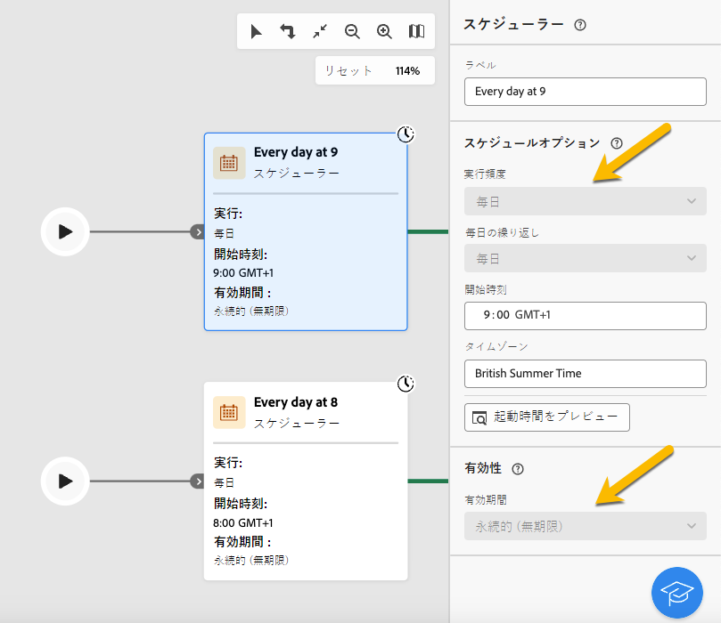
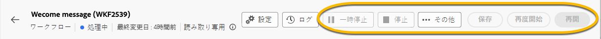

# 読み取り専用ワークフローについて {#readonly-workflows}

>[!CONTEXTUALHELP]
>
一部のワークフローは読み取り専用です。 ビルトインテクニカルワークフローは常に読み取り専用ですが、この制限は他のタイプのワークフローにも適用されます。

Campaign ユーザーは、Adobe Campaign データへのアクセスを制限されている場合があります。 Campaign 管理者は、特定の機能を表示する権限を付与できますが、編集や変更の権限は付与できません。 データとプロセスのセキュリティを確保するには、データに対するユーザー権限が不可欠です。 Campaign での権限管理について詳しくは、[ この節 ](../get-started/permissions.md) を参照してください。

ワークフローが読み取り専用モードの場合：

* メンション **[!UICONTROL 読み取り専用]** が「**[!UICONTROL 設定]** ボタンの近くに表示されます。
* アクションボタンにアクセスできません。

{zoomable="yes"}

ユーザーは、読み取り専用ワークフローでは何も編集できません。アクティビティの設定を変更することはできません。

{zoomable="yes"}

ユーザーはワークフローを削除できません。

{zoomable="yes"}

## 読み取り専用ワークフローのタイプ {#readonly-workflow-types}

ワークフローのタイプによって、読み取り専用モードは異なる場合があります。

### キャンペーンワークフロー {#readonly-campaign-wf}

読み取り専用のキャンペーンワークフローでは、ユーザーは「監視」ボタンにアクセスできません。

{zoomable="yes"}

### テクニカルワークフロー {#readonly-tech-wf}

ビルトインテクニカルワークフローは、管理者を含むすべての Campaign ユーザーに対して読み取り専用です。 ただし、ユーザーは、必要に応じて&#x200B;**一時停止**&#x200B;または&#x200B;**停止**&#x200B;することができます。許可されているアクションはこれだけです。

{zoomable="yes"}。

テクニカルワークフローについて詳しくは、[ この節 ](https://experienceleague.adobe.com/ja/docs/campaign/automation/workflows/introduction/wf-type/technical-workflows) を参照してください。