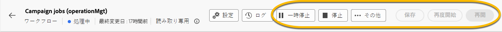

# 読み取り専用ワークフローについて {#readonly-workflows}

>[!CONTEXTUALHELP]
>id="acw_wf_read_only_canvas"
>title="このワークフローは読み取り専用です"
>abstract="ユーザーの権限またはワークフローの種類により、このワークフローを編集できません。"

一部のワークフローは読み取り専用モードである場合があります。 次を使用して確認できます。

- メンション **[!UICONTROL **&#x200B;読み取り専用&#x200B;**]**  近く **[!UICONTROL 設定]** ボタン
- アクションボタンにアクセスできません

{zoomable="yes"}

読み取り専用ワークフロー内では編集できません。 アクティビティの設定を変更することはできません。

{zoomable="yes"}

ワークフローを削除する権限もありません。

{zoomable="yes"}

## 読み取り専用ワークフローを使用する理由

読み取り専用モードは、ワークフローを編集するための権限とアクセス権を持たないユーザー用です。 [詳しくはこちらを参照してください](../get-started/permissions.md)

Campaign ユーザーは、Adobe Campaignでアクセスできるデータが制限されている場合があります。 管理者は、一部の機能を表示する機会を彼に与えることができますが、操作することはできません。

## 読み取り専用ワークフローのタイプ

ワークフローのタイプによって、読み取り専用モードが異なる場合があります。

### キャンペーンワークフロー

読み取り専用のキャンペーンワークフローの場合、ユーザーは「監視」ボタンにアクセスできません。

{zoomable="yes"}

### テクニカルワークフロー

テクニカルワークフローは、Campaign ユーザーに対して読み取り専用モードになります。
ビルトインテクニカルワークフローは、管理者ユーザーであっても、すべてのユーザーに対して読み取り専用モードになります。 ただし、ユーザーは次の操作を実行できます **pause** または **停止** 必要な場合は、それらを使用します。 許可されているアクションはこれだけです。 [詳しくはこちらを参照してください](https://experienceleague.adobe.com/en/docs/campaign/automation/workflows/introduction/wf-type/technical-workflows)

{zoomable="yes"}