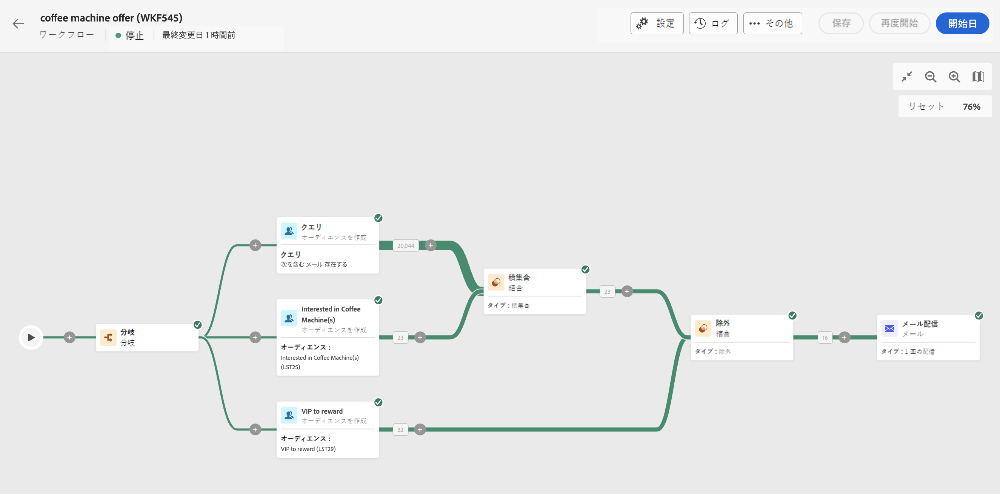
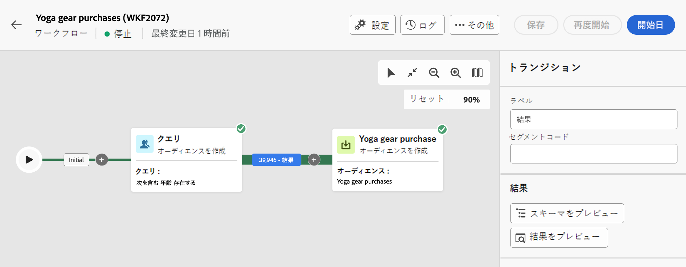
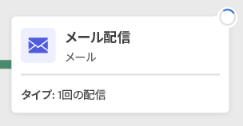
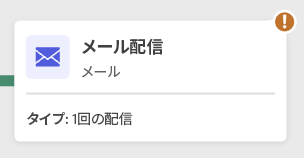
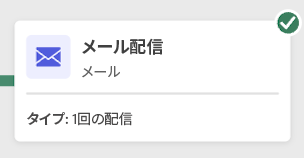
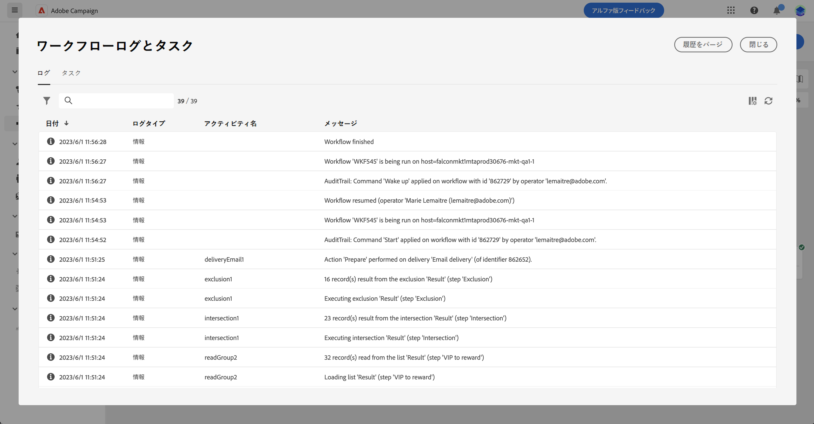

# ワークフローの開始と監視 {#start-monitor}

ワークフローを作成し、キャンバスで実行するタスクを設計したら、ワークフローを起動して、その実行状況を監視できます。

## ワークフローを開始 {#start}

ワークフローを開始するには、**[!UICONTROL ワークフロー]**&#x200B;メニューまたは関連するキャンペーンに移動し、キャンバスの右上隅にある「**[!UICONTROL 開始]**」ボタンをクリックします。

ワークフローが実行されると、ワークフローの最後に達するまで、キャンバス内の各アクティビティが順番に実行されます。

視覚的なフローを使用すると、ターゲットプロファイルの進行状況をリアルタイムで追跡できます。これにより、各アクティビティのステータスと、アクティビティ間で移行中のプロファイルの数をすばやく識別できます。

{zoomable="yes"}

## ワークフローのトランジション {#transitions}

ワークフローでは、トランジションを通じて 1 つのアクティビティから別のアクティビティへ移されたデータは、一時的な作業用テーブルに保存されます。このデータは、トランジションごとに表示できます。これを行うには、トランジションを選択して、画面の右側でそのプロパティを開きます。

* 「**[!UICONTROL スキーマをプレビュー]**」をクリックして、作業用テーブルのスキーマを表示します。
* 「**[!UICONTROL 結果をプレビュー]**」をクリックして、選択したトランジションで転送されたデータを視覚化します。

{zoomable="yes"}

## アクティビティ実行を監視 {#activities}

各アクティビティボックスの右上隅にある視覚的な指標を使用すると、アクティビティの実行を確認できます。

| 視覚的な指標 | 説明 |
|-----|------------|
| {zoomable="yes"}{width="70%"} | このアクティビティは現在実行中です。 |
| {zoomable="yes"}{width="70%"} | このアクティビティには注意が必要です。これには、配信の送信確認や、必要なアクションの実行が含まれる場合があります。 |
| {zoomable="yes"}{width="70%"} | アクティビティでエラーが発生しました。この問題を解決するには、ワークフローのログを開いて詳細を確認します。 |
| {zoomable="yes"}{width="70%"} | アクティビティが正常に実行されました。 |

## ログとタスクを監視 {#logs-tasks}

ワークフローのログとタスクの監視は、ワークフローを分析し、正しく実行されていることを確認するための重要な手順です。これらには、アクションツールバーと各アクティビティのプロパティパネルにある「**[!UICONTROL ログ]**」アイコンからアクセスできます。

**[!UICONTROL ログとタスク]**&#x200B;メニューには、ワークフローの実行履歴が表示され、すべてのユーザーのアクションと発生したエラーが記録されます。この履歴は、ワークフロー[実行オプション](workflow-settings.md)で指定された期間保存されます。この期間中は、ワークフローが再開された後も、すべてのメッセージが保存されます。以前の実行したメッセージを保存しない場合は、「**[!UICONTROL 履歴をパージ]**」ボタンをクリックします。

{zoomable="yes"}

次の 2 種類の情報を使用できます。

* 「**[!UICONTROL ログ]**」タブには、すべてのワークフローアクティビティの実行履歴が表示されます。実行された操作と実行エラーのインデックスを時系列順に作成します。
* 「**[!UICONTROL タスク]**」タブでは、アクティビティの実行順序の詳細が表示されます。

両方のタブで、表示される列とその順序を選択し、フィルターを適用し、検索フィールドを使用して目的の情報をすばやく見つけることができます。

## ワークフロー実行コマンド {#execution-commands}

右上隅のアクションバーには、ワークフローの実行を管理できるコマンドが用意されています。以下を行うことができます。

* ワークフローの実行を&#x200B;**[!UICONTROL 開始]**／**[!UICONTROL 再開]**&#x200B;すると、進捗ステータスになります。ワークフローが一時停止していた場合は再開されます。それ以外の場合は、ワークフローが開始され、初期のアクティビティが有効化されます。

* ワークフローの実行を「**[!UICONTROL 一時停止]**」すると、一時停止のステータスになります。ワークフローが再開されるまでは新しいアクティビティは有効化されません。ただし、進行中の操作は中断されません。

* 実行中のワークフローを「**[!UICONTROL 停止]**」すると、完了ステータスになります。進行中の操作は、可能であれば中断されます。ワークフローを停止した場所から再開することはできません。
