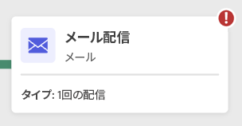

# ワークフローを開始および監視 {#start-monitor}

ワークフローを作成し、キャンバスで実行するタスクを設計したら、ワークフローを起動して、実行方法を監視できます。

## ワークフローの開始 {#start}

ワークフローを開始するには、 **[!UICONTROL ワークフロー]** メニューまたは関連するキャンペーンを選択し、 **[!UICONTROL 開始]** ボタンを使用して、画面の右上隅に表示されます。

ワークフローが実行されると、ワークフローの最後に達するまで、キャンバス内の各アクティビティが順番に実行されます。

視覚的なフローを使用して、ターゲットプロファイルの進行状況をリアルタイムで追跡できます。 これにより、各アクティビティのステータスと、それらの間の移行中のプロファイルの数をすばやく識別できます。

>[!NOTE]
>
>ビジュアルフローを無効にするには、 **[!UICONTROL 進行状況を非表示]** ボタンをクリックします。

## アクティビティ実行の監視 {#activities}

各アクティビティボックスの右上隅にある視覚的な指標を使用すると、実行を確認できます。

| 視覚指標 | 説明 |
|-----|------------|
|  | アクティビティは現在実行中です。 |
|  | このアクティビティには注意が必要です。 これには、配信の送信の確認や、必要なアクションの実行が含まれる場合があります。 |
|  | アクティビティでエラーが発生しました。 この問題を解決するには、ワークフローのログを開いて詳細を確認します。 |
|  | アクティビティが正常に実行されました。 |

## ログとタスクの監視 {#logs-tasks}

ワークフローのログとタスクの監視は、ワークフローを分析し、正しく実行されていることを確認するための重要な手順です。 これらは、 **[!UICONTROL ログ]** アクションツールバーと各アクティビティのプロパティペインで使用できるアイコン。

この **[!UICONTROL ログとタスク]** メニューには、ワークフローの実行履歴が表示され、すべてのユーザーのアクションと発生したエラーが記録されます。 この履歴は、ワークフローで指定された期間保存されます [実行オプション](workflow-settings.md). この期間中は、ワークフローが再開された後も、すべてのメッセージが保存されます。 以前の実行のメッセージを保存しない場合は、 **[!UICONTROL 履歴をパージ]** 」ボタンをクリックします。

次の 2 種類の情報を使用できます。

* この **[!UICONTROL ログ]** 「 」タブには、すべてのワークフローアクティビティの実行履歴が表示されます。 実行された操作と実行エラーのインデックスを時系列順に作成します。
* この **[!UICONTROL タスク]** 「 」タブでは、アクティビティの実行順序の詳細を説明します。

両方のタブで、表示される列とその順序を選択し、フィルターを適用し、検索フィールドを使用して目的の情報をすばやく見つけることができます。

## ワークフロー実行コマンド {#execution-commands}

右上隅のアクションバーには、ワークフローの実行を管理するためのコマンドが用意されています。 以下を行うことができます。

* **[!UICONTROL 開始]** / **[!UICONTROL 再開]** ワークフローの実行。「処理中」ステータスが適用されます。 ワークフローが一時停止した場合は再開します。それ以外の場合は、ワークフローが開始され、最初のアクティビティが有効化されます。

* **[!UICONTROL 一時停止]** ワークフローの実行。一時停止のステータスが適用されます。 再開されるまで、新しいアクティビティはアクティブ化されませんが、進行中の操作は中断されません。

* **[!UICONTROL 停止]** 実行中のワークフローで、「完了」ステータスが適用されます。 処理中の操作が可能な場合は中断されます。 停止した場所からは、ワークフローを再開できません。
