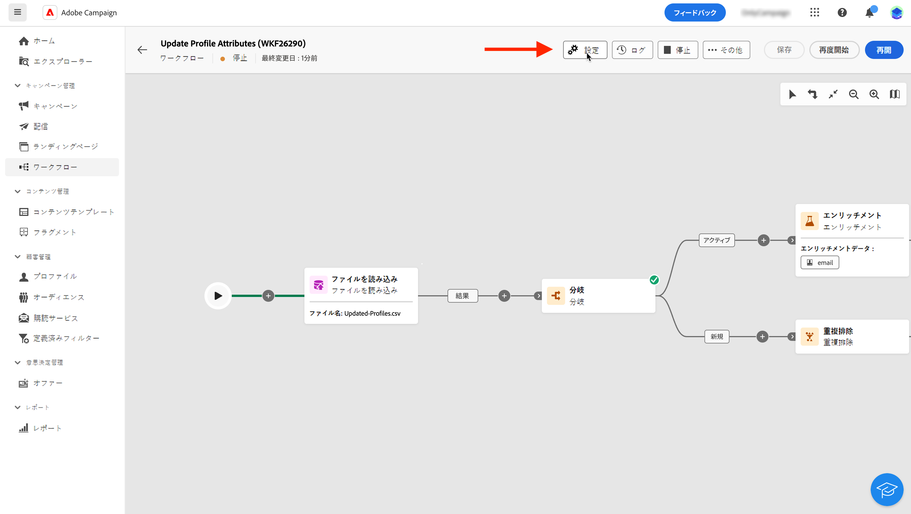

# ワークフロー設定の指定 {#workflow-settings}

キャンバスでワークフローアクティビティを調整する際に、ワークフローに関連する詳細設定にアクセスできます。例えば、ワークフローの特定のタイムゾーンを設定したり、エラーが発生した場合のワークフローの動作を管理したり、ワークフローの履歴をパージする遅延時間を管理したりできます。

これらの設定は、ワークフローの作成時に選択したテンプレートで事前に設定されていますが、この特定のワークフローで必要に応じて編集できます。

これを行うには、ワークフローキャンバス上のアクションバーにある「**[!UICONTROL 設定]**」ボタンをクリックします。

{width="70%" align="left"}

## ワークフローのプロパティ {#properties}

>[!CONTEXTUALHELP]
>id="acw_workflow_settings_properties"
>title="ワークフローのプロパティ"
>abstract="このセクションでは、ワークフローの作成時にもアクセスできる一般的なワークフロープロパティを提供します。ワークフローの作成に使用するテンプレートを選択し、ラベルを指定できます。「その他のオプション」セクションを展開して、ワークフロー保存フォルダーやタイムゾーンなどの特定の設定を指定します。"

「**[!UICONTROL プロパティ]**」セクションには、ワークフローの作成時に利用できる一般的な設定が用意されています。

{width="70%" align="left"}

次のプロパティがあります。

* The **[!UICONTROL ラベル]** 」で指定します。
* The **[!UICONTROL 内部名]** 」で指定します。
* The **[!UICONTROL フォルダー]** ワークフローの保存先。
* デフォルト **[!UICONTROL タイムゾーン]** を使用して、ワークフローのすべてのアクティビティで使用できます。 デフォルトでは、現在の Campaign オペレーターに指定されたタイムゾーンがワークフローのタイムゾーンになります。
次のような値を選択できます。
   * **サーバーのタイムゾーン**：Adobe Campaign アプリケーションサーバーのタイムゾーンを使用します
   * **オペレーターのタイムゾーン**：オペレーターのプロファイルで定義しているように、クライアントコンソールでワークフローを実行する Adobe Campaign オペレーターのタイムゾーンを使用します
   * **データベースのタイムゾーン**：データベースサーバーのタイムゾーンを使用します
   * 特定のタイムゾーン
* ワークフローが失敗した場合、 **[!UICONTROL スーパーバイザー]** フィールドに電子メールで通知されます。
* *また、 **[!UICONTROL 説明]** 」で指定します。

ワークフローが [キャンペーンに関連付けられている](create-workflow.md)に値を指定しない場合、 **[!UICONTROL リンクされたキャンペーン]** フィールドに入力します。 関連するキャンペーンは、このフィールドから開くことができます。

## セグメント化の設定  {#segmentation-settings}

>[!CONTEXTUALHELP]
>id="acw_workflow_settings_segmentation"
>title="セグメント化の設定"
>abstract="このセクションでは、ワークフローでプロファイルを対象とするターゲティングディメンションを選択し、2 回の実行の間にワークフローの結果を保持するように選択できます。このオプションは、テスト目的でのみ使用し、実稼動ワークフローでは絶対に有効にしないでください。"

* **[!UICONTROL ターゲティングディメンション]**：プロファイルのターゲットに使用するターゲティングディメンションを受信者、契約の受益者、オペレーター、サブスクライバーなどから選択します。[ターゲティングディメンションについての詳細を学ぶ](../audience/targeting-dimensions.md)

* **[!UICONTROL 2 つの実行間の中間母集団の結果を保持]**：デフォルトでは、最後に実行したワークフローの作業用テーブルのみが保持されます。それ以前に実行した分の作業用テーブルは、毎日実行されるテクニカルワークフローによりパージされます。

  このオプションを有効にした場合、作業用テーブルはワークフローが実行された後も保持されます。テスト目的で使用できるので、使用する必要があります **のみ** 開発環境またはステージング環境で使用する。 実稼動ワークフローでは絶対にオンにしないでください。

## 実行設定  {#exec-settings}

>[!CONTEXTUALHELP]
>id="acw_workflow_settings_execution"
>title="実行設定"
>abstract="このセクションでは、ワークフローの履歴を保持する日数など、ワークフローの実行に関する設定を指定できます。"

* **[!UICONTROL 履歴（日数）]**：履歴をパージする必要があるまでの日数を指定します。履歴には、ログ、タスク、イベント（ワークフロー操作にリンクされたテクニカルオブジェクト）など、ワークフローに関連する要素が含まれます。標準のワークフローテンプレートのデフォルト値は 30 日です。履歴のパージは、デフォルトで毎日実行されるデータベースクリーンアップテクニカルワークフローによって実行されます

  >[!IMPORTANT]
  >
  >「**[!UICONTROL 履歴（日数）]**」フィールドが空白のままの場合、その値は「1」と見なされます。つまり、履歴は 1 日後にパージされます。

* **[!UICONTROL デフォルトの親和性]**：インストールに複数のワークフローサーバーが含まれる場合、このフィールドを使用して、ワークフローを実行するサーバーを指定します。 これにより、特定のサーバーでそのワークフローが強制的に実行されます。 既存のアフィニティ名を選択することはできますが、スペースや句読点を使用しないようにしてください。 異なるサーバーを使用する場合は、異なる名前をコンマで区切って指定します。

  >[!IMPORTANT]
  >
  >このフィールドで定義した値がどのサーバーにも存在しない場合、ワークフローは保留されたままになります。

* **[!UICONTROL SQL クエリをログに保存]**：ワークフローからログに SQL クエリを保存する場合は、このオプションを選択します。 この機能を設定できるのは上級ユーザーに限られます。**[!UICONTROL オーディエンスの作成]**&#x200B;のようなターゲティングアクティビティを含むワークフローに適用されます。このオプションを有効にした場合、ワークフローの実行中にデータベースに送信される SQL クエリがワークフローのログに表示されるので、この内容を分析することで、クエリの最適化や問題の診断が可能になります。

## エラー管理の設定  {#error-settings}

>[!CONTEXTUALHELP]
>id="acw_workflow_settings_error"
>title="エラー管理の設定"
>abstract="この節では、実行中のエラーの管理方法を定義できます。 プロセスの一時停止、一定数のエラーの無視、またはワークフローの実行の停止を選択できます。"

* **[!UICONTROL エラー管理]**：このフィールドでは、ワークフロータスクでエラーが発生した場合に行うアクションを定義できます。次の 3 つのオプションが使用可能です。

   * **[!UICONTROL プロセスを中断]**：ワークフローは自動的に一時停止され、ワークフローのステータスは「**[!UICONTROL 失敗]**」に変わります。問題が解決したら、「**[!UICONTROL 再開]**」ボタンを使用してワークフローを再開します。
   * **[!UICONTROL 無視]**：エラーをトリガーしたタスクのステータスは「**[!UICONTROL 失敗]**」に変わりますが、ワークフローのステータスは「**[!UICONTROL 開始済み]**」のままです。<!-- TO ADD ONCE SCHEUDLER IS AVAILABLE This configuration is relevant for recurring tasks: if the branch includes a scheduler, it will start normally next time the workflow is executed.-->
   * **[!UICONTROL プロセスを中止]**：ワークフローは自動的に停止し、ステータスは「**[!UICONTROL 失敗]**」に変わります。問題が解決したら、「**[!UICONTROL 開始]**」ボタンを使用してワークフローを再開します。

* **[!UICONTROL 連続エラー]**：このフィールドは、「**[!UICONTROL エラーの場合]**」フィールドで「**[!UICONTROL 無視]**」の値が選択されたときに有効になります。プロセスを停止するまでに無視するエラーの数を指定できます。この数に達すると、ワークフローのステータスが「**[!UICONTROL 失敗]**」に変わります。このフィールドの値が 0 の場合、エラーの数にかかわらず、ワークフローが停止することはありません。
